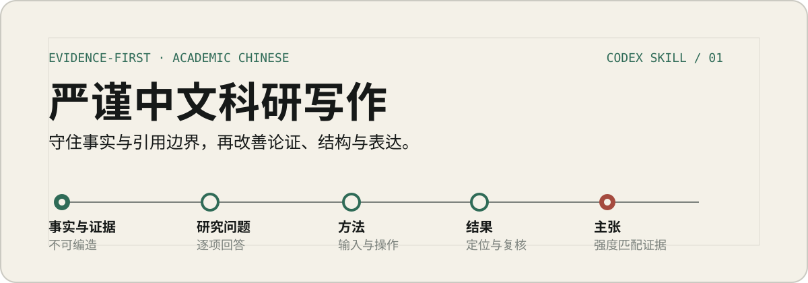

<h1 align="center">
  
</h1>

<p align="center">对中文论文与研究报告进行系统审校，核对事实证据、方法—结果关系、成果完整性、跨章节口径和图表论证，并修订结构与表达。</p>

面向中文科学论文、学位论文、研究报告和技术报告的 Codex Skill。它支持局部润色、深度修订、反馈整合和终稿审计；处理语言之前，先核对文稿中的事实、证据和论证关系。

`Evidence-first` · `Academic Chinese` · `Python 3` · `MIT`

## 一段真实的审校示例

下面以一段数据质量治理综述的引言为例，展示如何在不补写来源的前提下校准主张强度、梳理论述层次，并保护原文已有的信息。

**原文**

> 数字经济时代，数据已成为新型生产要素。然而，普遍存在的数据质量问题严重制约着数据要素的价值释放，甚至可能演变为数字经济发展的“灰犀牛”。据估计，劣质数据给企业造成的损失约占其年收入的15%至25%，主要体现在次优决策、合规处罚和运营低效等方面。在此背景下，数据质量治理——即通过组织、流程和技术手段系统性地确保和提升数据质量的实践活动——已成为学术界和工业界共同关注的焦点议题。
>
> 数据质量治理的研究历经数十年的发展，已从早期的概念界定与探索阶段，演进到模型与技术发展阶段，如今正进入场景应用深化阶段。研究遵循“内涵—理论—方法—应用”的逻辑链条不断拓展，覆盖了计算机科学、管理学、经济学等多个学科领域。本文旨在系统梳理数据质量治理的核心概念、评估框架、治理方法论、关键技术及前沿趋势，为后续研究与实践提供参考。

</details>

复核发现，`15%—25%` 缺少数据来源、样本范围、统计年份和计算口径，暂不能作为已核验事实写入成稿；“灰犀牛”“严重制约”和“共同关注的焦点议题”带有较强的评价色彩；“历经数十年”及三阶段演进判断也需要文献支持。原文最后一句只笼统提出“提供参考”，尚未说明这篇综述具体比较什么、服务于何种研究或实践决策。

**修订**
>
> 随着数据被纳入生产要素配置和组织决策，数据质量直接影响数据的可用性及其价值实现。数据质量缺陷可能通过次优决策、合规处罚和运营低效增加企业成本。因此，如何借助组织机制、业务流程和技术手段保障并持续改进数据质量，已成为数据管理研究与实践中的重要问题。本文将此类活动统称为数据质量治理。
>
> 本文以“内涵—理论—方法—应用”为主线，梳理数据质量治理的核心概念、评估框架、治理方法和关键技术，讨论相关研究在计算机科学、管理学和经济学等领域的应用及发展趋势。在此基础上，重点比较不同框架和方法的研究对象、实施条件与适用范围，为后续研究的问题选择和治理实践的方法配置提供依据。

修订稿保留了数据质量缺陷的三类影响、数据质量治理的组织—流程—技术内涵、综述主线、核心议题和学科范围。无法核验的损失比例没有被改写成模糊数量或另造来源，而是移至正文外等待补证；研究史分期和修辞性判断也未被包装成既定事实。

## 审校范围

| 层级       | 核对重点                                                                                 |
| ---------- | ---------------------------------------------------------------------------------------- |
| 事实与信息 | 核对数字、单位、范围、样本、专有名词、图表编号和引用位置，防止口径变化或具体信息被泛化。 |
| 研究设计   | 检查研究问题、材料、方法、结果和结论的对应关系，确认声明的方法得到实际应用。             |
| 成果完整性 | 检查模型、框架、指标等成果的最低构件，以及研究范围、案例覆盖和结论强度是否相称。         |
| 主张与证据 | 区分事实、计算、描述、解释、评价和因果主张，避免把标签、相关或结构适用写成既定事实。     |
| 结构与图表 | 检查标题层级与章节功能、图形抽象层级、图表信息增量、视觉语义和汇总结果追溯。       |
| 术语与表达 | 执行首次出现审计，处理术语漂移、指代、翻译腔和无信息的模板化表达。                       |

脚本命中、词频和句段统计只用于定位复核位置。是否修改以及怎样修改，仍由上下文中的语义、证据和文稿规范决定。

## 四种任务模式

| 模式     | 处理范围                                                                 |
| -------- | ------------------------------------------------------------------------ |
| 局部润色 | 用于内容和论证已经稳定的文本，处理词语、句法、指代、节奏和少量段内顺序。 |
| 深度修订 | 用于整章、全文或结构性问题，允许调整段落、章节接口和方法—结果关系。     |
| 反馈整合 | 整理导师批注、审稿意见、会议纪要或多版意见，追踪依据、处置和验证结果。   |
| 终稿审计 | 在提交或交付前定位事实、证据、结构、术语和格式风险。                     |

审计任务默认报告问题，不自动扩展为全文改写。局部润色也不会自行改变研究设计或论证结构。

深度修订、终稿审计和反馈整合默认附简短的正文外交付摘要，说明本次使用的材料与核验边界、已改或已查范围，以及确实存在的待核验事实或引用、缺失材料和未决口径。没有问题的字段不输出，也不把工作日志塞入论文正文。

## 工作方式

```text
动态建立文档模型
        ↓
确定性与统计检查
        ↓
语义审计
        ↓
最小充分修改
        ↓
回归审计
```

审校始终按照以下顺序处理：

```text
事实与不可改动项 → 研究问题 → 方法与结果 → 主张与证据 → 结构 → 术语 → 表达
```

深度修订还会对照原文和修订稿，检查时间、数量、对象、案例、限定条件和不确定性是否被无理由删减或概括，并在基础定义或口径变化后追踪所有下游章节和图表。处理 DOCX、PDF 等图文文档时，工具条件允许即实际查看图形页面。完整规则见 [SKILL.md](./SKILL.md)。

## 安装

### 使用 skill-installer

在 Codex 中调用 `$skill-installer`，提供本仓库的 GitHub URL，并要求安装 `rigorous-academic-writing-zh`。

### 使用 Git

在 PowerShell 中执行：

```powershell
git clone https://github.com/Jill-Stingray-L/rigorous-academic-writing-zh.git `
  "$HOME/.agents/skills/rigorous-academic-writing-zh"
```

个人 Skill 的默认目录是 `$HOME/.agents/skills`。如果安装后没有被 Codex 识别，请重新启动 Codex。

## 首次使用

在 Codex 中显式调用：

```text
$rigorous-academic-writing-zh
请对这份中文论文进行终稿审计，核对事实与引用、方法—结果关系和主张强度。先列出需要复核的问题，不要直接重写全文。
```

也可以明确要求局部润色、深度修订或反馈整合。任务描述与 Skill 的适用范围一致时，Codex 也可以自动选择它。

## 确定性审计脚本

仓库包含一个仅使用 Python 标准库的辅助脚本，支持 UTF-8 Markdown 和纯文本：

```powershell
python scripts/audit_academic_zh.py manuscript.md
python scripts/audit_academic_zh.py manuscript.md --format json
python scripts/audit_academic_zh.py manuscript.md --glossary glossary.json
```

脚本用于定位聊天或编辑残留、术语字面变体、标题并列与重复句壳、计划—实施状态混用、工作日志式未来任务、理论章节中的项目执行语言、节级重复证据边界、图表编号、长句、局部结构重复和连接词等线索。所有结果都是人工复核提示；它不判断作者身份，不给论文打分，也不自动改写输入文本。

Markdown 标题树、叶节点小节和章节厚度检查只适用于 Markdown。纯文本需要进行结构审计时，应先把正式章节标题规范化为 Markdown 标题。

维护脚本规则时先运行回归测试：

```powershell
python -m unittest discover -s tests -v
```

## 能力边界

- 不补写没有来源的数据、样本、文献、DOI、页码、引语或实施成效。
- 不提供作者身份概率、检测通过承诺或规避检测方案。
- 不为改变统计特征而随机拆句、轮换同义词或加入语言噪声。
- 原稿与来源发生实质冲突时，在正文外标明冲突并请求确认。
- 表面句式只有造成具体的语义、证据、指代或表达问题时才处理。

## 仓库结构

```text
rigorous-academic-writing-zh/
├── SKILL.md                         # 入口、适用范围与核心工作流
├── agents/openai.yaml               # Codex 界面元数据
├── scripts/audit_academic_zh.py     # 确定性与统计审计脚本
├── tests/                            # 审计脚本回归测试与最小夹具
├── references/                      # 按任务类型加载的审校规范
└── assets/readme/hero.svg           # README 视觉资产
```

## 参考与维护

规则来源和维护说明见 [references/provenance.md](./references/provenance.md)。外部资料用于提出候选问题和设计约束，不直接构成作者身份判断或自动修改依据。

Codex Skill 的目录结构、发现方式和安装位置以 [OpenAI 官方 Build skills 文档](https://learn.chatgpt.com/docs/build-skills) 为准。

## License

[MIT](./LICENSE) © 2026 rigorous-academic-writing-zh contributors
